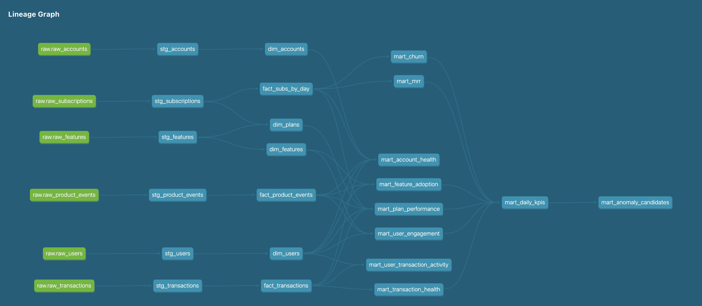
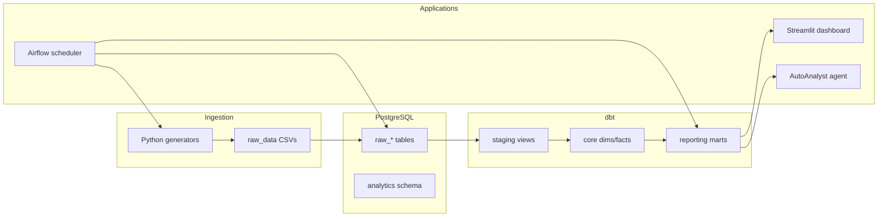
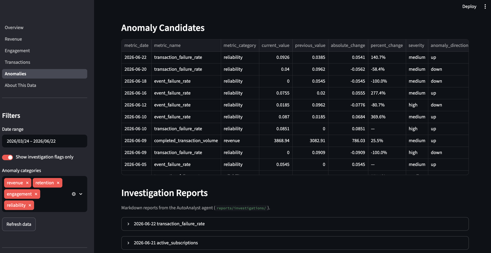

# AutoAnalyst

End-to-end analytics platform for a synthetic B2B SaaS company. Generates operational data, loads it into PostgreSQL, transforms it with dbt, orchestrates daily refreshes with Airflow, and surfaces KPIs in a Streamlit executive dashboard — with an AutoAnalyst agent that investigates flagged anomalies.

## Why this project matters

AutoAnalyst demonstrates a production-style analytics workflow: raw SaaS operational data is generated, loaded into PostgreSQL, transformed through dbt staging/core/reporting layers, validated with dbt tests, orchestrated with Airflow, and served through a Streamlit executive dashboard. An AI investigation agent reads anomaly candidates from dbt marts, runs targeted SQL checks, and writes plain-English investigation reports.





## What it does

AutoAnalyst simulates a subscription SaaS business and builds a full modern data stack:

1. **Ingestion** — Python scripts generate CSV backfill and daily incremental batches
2. **Loading** — Raw tables in PostgreSQL (`raw_*`)
3. **Transformation** — dbt builds staging views, core dimensions/facts, and reporting marts
4. **Orchestration** — Airflow runs the daily pipeline on a schedule
5. **Visualization** — Streamlit dashboard (MRR, churn, engagement, transactions, anomalies)
6. **Investigation** — AutoAnalyst agent pulls SQL evidence and writes markdown reports

## Architecture



## Quick start (Docker)

**Prerequisites:** [Docker Desktop](https://www.docker.com/products/docker-desktop/) only.

```bash
git clone https://github.com/0GregoryJ/AutoAnalyst.git
cd AutoAnalyst

cp .env.example .env
cp dbt/profiles.yml.example dbt/profiles.yml
# Edit .env and set POSTGRES_PASSWORD

docker compose up -d --build postgres
./scripts/bootstrap.sh
```

Open **http://localhost:8501** for the dashboard.

### What bootstrap does

1. Generates historical CSV backfill (~2022 → today)
2. Loads `raw_*` tables into Postgres
3. Runs `dbt run` and `dbt test`
4. Starts the Streamlit app

First run takes a few minutes while data is generated and models are built.

To reset and re-bootstrap from scratch: `docker compose down -v` (deletes Postgres data), then run bootstrap again.

### Service URLs

| Service | URL | Notes |
|---------|-----|-------|
| Dashboard | http://localhost:8501 | Main demo |
| Airflow | http://localhost:8080 | `admin` / `admin` — start with `docker compose up -d airflow-webserver airflow-scheduler` |
| dbt docs | http://localhost:8082 | `docker compose up dbt-docs` |
| pgAdmin | http://localhost:5050 | `admin@autoanalyst.com` / `admin` — debugging only |

### Daily pipeline (Airflow)

DAG `autoanalyst_daily_pipeline` runs daily at 06:00 UTC:

```text
generate_daily_batch → load_raw_tables → dbt_run → dbt_test → run_investigation
```

Trigger manually from the Airflow UI to generate a new daily batch and an investigation report.

### Anomaly investigation

The **Anomalies** page flags metrics from `mart_anomaly_candidates`. The AutoAnalyst agent investigates the top priority anomaly, queries supporting SQL evidence from dbt marts, and writes a markdown report.



Sample report: [2026-06-13_transaction_failure_rate.md](reports/investigations/2026-06-13_transaction_failure_rate.md)

## Tech stack

- **Python 3.12** — ingestion, loading, agent
- **PostgreSQL 16** — warehouse
- **dbt Core** — modeling and tests
- **Apache Airflow 2.10** — scheduling
- **Streamlit + Plotly** — dashboard

## Project structure

```text
AutoAnalyst/
├── README.md
├── docker-compose.yml
├── scripts/bootstrap.sh      # one-time data + dbt setup
├── .env.example              # secrets template (committed)
├── docs/screenshots/         # README visuals
├── src/
│   ├── ingestion/            # data generation + Postgres loading
│   ├── agent/                # anomaly investigation workflow
│   └── utils/db.py           # shared Postgres connection
├── dbt/                      # dbt project → analytics schema
├── airflow/dags/             # daily pipeline DAG
├── dashboard/                # Streamlit app
├── raw_data/                 # generated CSVs (gitignored)
└── reports/investigations/   # agent markdown reports
```

## Project scale

- 6 raw source tables
- 22 dbt models
- 200+ dbt tests
- Historical SaaS data generated from 2022 through present
- Daily incremental batch pipeline
- Airflow DAG with dbt test quality gate
- Streamlit dashboard with executive KPIs and anomaly investigations

## Documentation

| Topic | Location |
|-------|----------|
| dbt models, tests, profiles | [dbt/README.md](dbt/README.md) |
| Airflow DAG, troubleshooting | [airflow/README.md](airflow/README.md) |
| Dashboard pages, agent UI | [dashboard/README.md](dashboard/README.md) |
| Agent tools and reports | [src/agent/README.md](src/agent/README.md) |

## Advanced: local Python development

For day-to-day development without Docker, use a local virtualenv and Postgres on port 5433 (or update `POSTGRES_PORT` in `.env`).

```bash
python3.12 -m venv .venv
source .venv/bin/activate
pip install -r requirements.txt

cp .env.example .env
cp dbt/profiles.yml.example dbt/profiles.yml
# Set POSTGRES_PASSWORD; use POSTGRES_HOST=localhost POSTGRES_PORT=5433 for Docker Postgres

python src/ingestion/generate_historical_backfill.py
python -c "from src.ingestion.load_raw_tables import load_backfill; load_backfill()"
cd dbt && dbt run && dbt test
streamlit run dashboard/app.py
```

Airflow uses a **separate venv** (SQLAlchemy 1.4 vs 2.x). See [airflow/README.md](airflow/README.md).

## Notes

- `raw_data/`, `dbt/target/`, and most investigation reports are gitignored — reproduce via `./scripts/bootstrap.sh`
- Do not install `apache-airflow` into the root `.venv`
- Optional: set `OPENAI_API_KEY` in `.env` for full LLM-written investigation reports (falls back to rule-based output without it)

## dbt docs


```bash
docker compose up dbt-docs
# → http://localhost:8082
```

## License

This project is licensed under the MIT License.